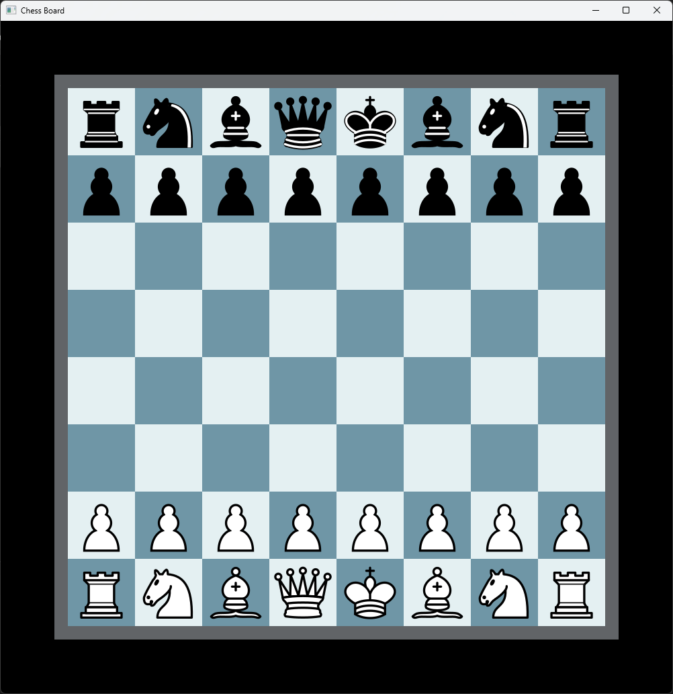

A simple chessboard built with C++ and SFML.

The project currently renders an 8x8 chessboard and will eventually support full gameplay.

This project is primarily an attempt to learn SFML.

Preview below:

This project uses SFML 3.0.2. To compile the project, install the Visual C++ 17 (Visual Studio 2022) build of SFML.

Chess piece images sourced from Wikimedia Commons  
Original creator: Cburnett  
License: CC BY-SA 3.0  
https://creativecommons.org/licenses/by-sa/3.0/
